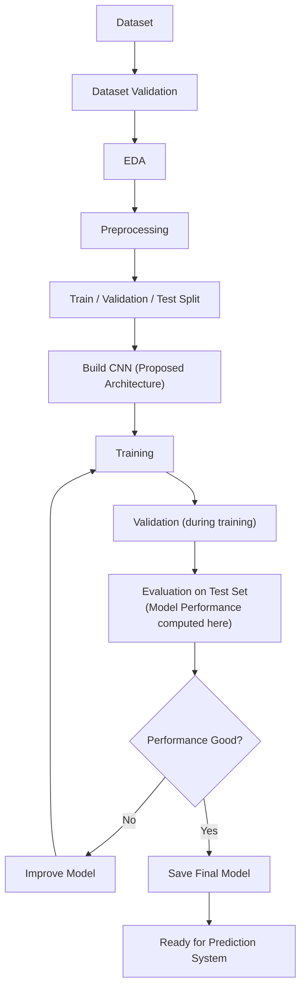
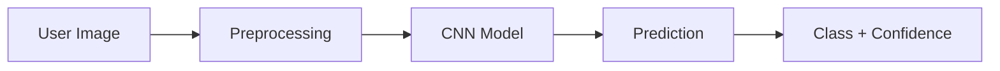

<div align="center">

# Image Classification System

</div>

## 📌 نبذة عن المشروع

مشروع لتصنيف الصور باستخدام شبكات عصبونية من نوع CNN. يتدرّب النظام على Dataset مصنّف إلى Classes، ثم يستقبل صورة جديدة من المستخدم ويحدد الفئة التي تنتمي إليها مع نسبة الثقة في هذا التنبؤ. النظام مصمَّم ليكون عامًا وغير مرتبط بمجال تصنيف واحد.

## 🗺️ خارطة الطريق

> **سير العمل المخطط — قابل للتغيير أثناء التطوير.**



## ⚙️ كيف يعمل النظام



مقاييس الأداء (Accuracy, Precision, Recall, F1-score) تُحسب بشكل منفصل أثناء التقييم على Test Dataset، وليس من صورة واحدة.

## 6. بنية CNN المخططة

> **نموذج CNN أساسي — مقترح.** عدد الطبقات الدقيق، وأحجام الفلاتر، وأبعاد الصور، والمعاملات غير محددة بعد (TBD)، وستُحدَّد أثناء التنفيذ والتجريب.

```
صورة الإدخال
  → طبقة التفاف (Convolution)
  → دالة تفعيل (Activation)
  → تجميع (Pooling)
  → طبقة التفاف (Convolution)
  → دالة تفعيل (Activation)
  → تجميع (Pooling)
  → تسطيح (Flatten)
  → طبقة كثيفة (Dense)
  → إسقاط (Dropout)
  → طبقة كثيفة (Dense)
  → المخرجات (Output)
```

## 🎯 الأهداف

- بناء نظام تصنيف صور.
- تطبيق الشبكات العصبية الالتفافية (CNN).
- تجربة أداء النموذج.
- تقييم النموذج باستخدام مقاييس متعددة.
- التدرّب على العمل التعاوني عبر Git/GitHub.
- توثيق عملية التطوير والدروس المستفادة.

## 🛠️ التقنيات المستخدمة

- Python
- TensorFlow / Keras
- NumPy, Pandas, Matplotlib
- Git & GitHub
